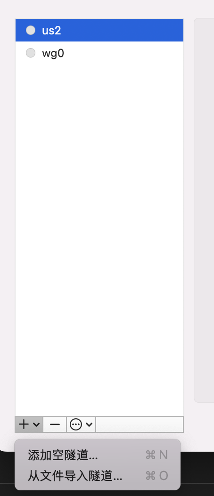

# WireGuard

简单高性能通用VPN
<!--more-->

## 1.安装及网关配置

```bash
# 1. server install
apt install wireguard

# 2.生成密钥
wg genkey | tee privatekey | wg pubkey > publickey

# 3. 配置独立网口
ip link add dev wg0 type wireguard
# 划分网关
ip address add dev wg0 192.168.2.1/24
# 或者单独几个IP
# ip address add dev wg0 192.168.2.1 peer 192.168.2.2
```

## 2. 配置文件及基本使用

配置服务器配置文件
> /etc/wireguard/wg0.conf

```conf
[Interface]
PrivateKey = <服务器私钥>
Address = 10.0.0.1/24
ListenPort = 51820

[Peer]
PublicKey = <客户端公钥>
AllowedIPs = 10.0.0.2/32
```

生成客户端配置文件

```conf
[Interface]
PrivateKey = <客户端私钥>
Address = 10.0.0.2/24

[Peer]
PublicKey = <服务器公钥>
Endpoint = 1.2.3.4:51820
AllowedIPs = 0.0.0.0/0, ::/0
PersistentKeepalive = 25
```
> macos 下载wireGuard后从文件导入上述配置文件即可使用


基本命令

```bash
# 查看服务状态以及连接的客户端
wg

# 启动服务
wg-quick up wg0

# 停止服务
wg-quick down wg0
```

> 链接上后，可通过 `wg` 查看客户端是否链接，也可通过 `ping` 对应服务器局域网IP检查

## 参考链接

+ [WireGuard官网](https://www.wireguard.com/quickstart/)
+ [chatGPT](https://chatgpt.com/)